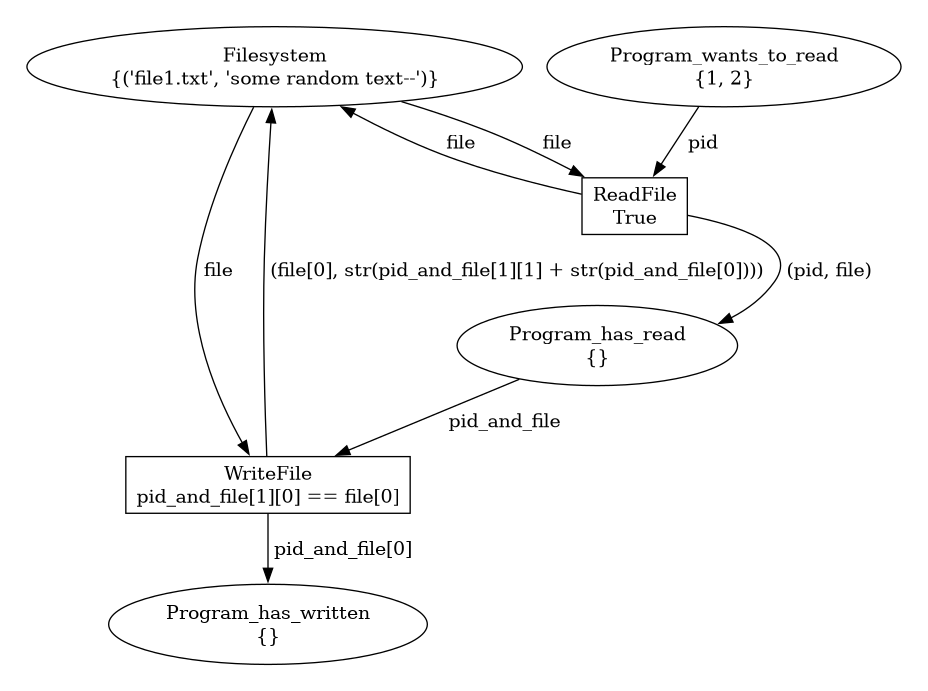

  * About This repository hosts example code and tutorials for CPN Exercises,
    and is a part of the material of [Requirements Engineering Lecture Course](https://github.com/ETCE-LAB/teaching-material/tree/master/Requirements-Engineering).
  * Installation
  
  This project manages the python dependencies using
  [pipenv](https://pipenv.pypa.io/)
  
  ```shell
  pipenv install
  pipenv activate
  ```
  
  * Usage
  
  - Please refer to the documentation of [SNAKES CPN](https://snakes.ibisc.univ-evry.fr/)
  - For examples refer to [CPN-I](CPN-I-RaceCondition), and [CPN-II](CPN-II-ChargingStation)

  
    * To Simulate the petri net and generate Simulation State PNG images:
    
    
    
    ```python
    from lib import simulator
    
    # Define your petri net
    net = PetriNet("MyPetriNet")
    
    # Add Places and Transitions
    
    # Store Transitions in a list
    
    transitions = [Transition("A"), Transition("B")]
    
    simulator.run_simulation(net, transitions, limit=20)  # Limit the maximum number of transition firings to avoid infinite loops


    ```
    
    
    
    If the simulation has no errors, png images of the petri net "MyPetriNet-*.png" images will appear in the root directory ordered by the simulation state index:
    
    
